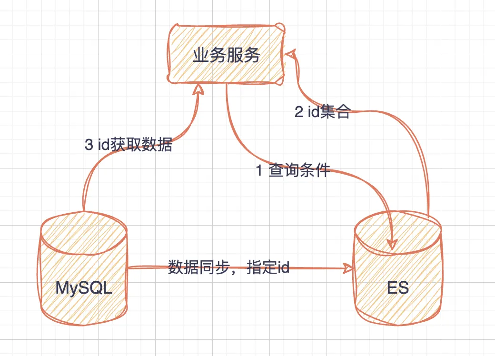

---

title: "Es应用实践指南"
slug: "Es应用实践"
description:
date: "2024-12-07T11:08:38+08:00"
lastmod: "2024-12-07T11:08:38+08:00"
image: cover.jpeg
math:
license:
hidden: false
draft: false
categories: ["中间件", "Elasticsearch"]
tags: ["mapping设计", "应用和ES交互"]

---

> 封面为《不良人》第六季中的尸祖降臣


ES常见的应用场景就是搜索，大多数业务系统的数据迁移到ES后，大都是等值、范围、like等，并未使用到match查询，相当于把ES搜索当做MySQL来使用。本文不会涉及到分词、搜索打分等场景，更倾向于常用数据的搜索。

## 业务服务和ES的交互方式
如何使用ES，会影响到Mapping的设计原则。在实践过程中，仅仅是把ES当做ID的筛选器。

+ 在数据同步阶段，只把需要搜索的字段同步到es中，降低单个文档的大小
+ 搜索阶段，通过es进行搜索，查询出id的集合，之后通过该id集合从MySQL中获取原始的数据源

流程的示意图如下




ES的搜索流程中，有两个阶段：search、fetch。

+ search阶段是从分片中搜索并获取相应文档id和其排序数据，在协调节点处理，生成结果集id
+ fetch阶段是将对应的结果集id，从id对应分片中获取实际的文档数据

从上述流程中，可以看到，**只使用到了search阶段，而fetch阶段替换成业务服务自行获取。**

这个<u>**方案的优点就是数据实时性高，可以规避ES数据滞后问题。**</u>


### 排序问题
根据id批量从MySQL中获取数据，返回的顺序会错乱，所以需要根据原id的顺序进行调整即可。

**<u></u>**

## mapping设计
mapping设计好，可以减少不必要的计算和写入，降低索引大小。


### 禁用Dynamic Mapping
动态映射在创建索引时有三种配置值，<u>**至少设置为false。**</u>

| 可选值 | 含义 |
| --- | --- |
| true | 自动添加到mapping中，并且支持索引和搜索 |
| runtime | 新字段将会被作为runtime类型的filed |
| false | 不会添加到mapping中，不支持索引和搜索。不过仍然会保存在_source中。 |
| strict | 如果发现新的field，会抛出异常 |


必须明确每个字段的数据类型，和其对应的属性配置，就类似于SQL的建表，严格确定结构。对于字段数据类型和其支持的属性配置，需要对ES有一定的熟悉程度，可以参考es的文档来进行设置，一般来说明确数据类型即可。


### 选择合适的数据类型
明确数据类型的时候，需要选择合适的数据类型，例如字符串类型的id、状态枚举等明确的值，选择keyword而不是text。


### 字段尽量少
字段尽可能少，最好做到只保留需要参与检索的字段。因为es需要提前构建倒排索引，所以字段越多，写入的时候占用的资源就越多，相同的 index buffer 能存储的数据条数越少。


这也和对ES的应用方式有关，在实践中，先利用ES检索出文档id，之后根据id从原始数据源MySQL中获取文档数据。


### 不需要的搜索的字段不要索引
不需要搜索的字段，如果还是需要同步到es中，那么可以将其指定为非搜索字段。将字段的Index属性设置为false即可，每个字段都会有该属性。可以降低es写入时的处理逻辑。

```json
PUT myindex
{
  "mappings": {
    "properties": {
      "content": { "type": "text" },
      "name": {
        "type": "text",
        "index": false
      }
    }
  }
}
```


### 结构扁平化
<font style="color:rgb(51, 51, 51);">尽量减少 object 类型的使用，更建议将数据扁平化。越是复杂的数据结构，系统要处理的事情就越多，写入就越慢。而且 nested、parent-child 等数据类型，在查询时候性能也很差。</font>


## 常见场景应用字段类型
对于业务系统来说，设计表的字段的场景不是很多，会有一些常见的场景。这里列一些常见场景设计的字段，以及对应的es数据类型。

| 场景值 | 字段类型 |
| --- | --- |
| id值、状态枚举、类型枚举 | keyword |
| 日期、时间、时间戳等 | date |
| 价格（转成分存储） | long |
| 日期时间范围（常见预约时间等场景） | date_range |
| 短字符（如名称等like查询场景） | wildcard |


这里比较特别的就是使用wildcard类型，来解决模糊匹配的场景，对应的就是SQL中的like。该数据类型是7.9版本提供的，对于wildcard类型的性能问题可以参考：[Elasticsearch 查询革新：探索 Wildcard 类型的高效模糊匹配策略](https://cloud.tencent.com/developer/article/2369990)。


## 总结
当前对于ES的应用，还是处于比较简单的水平，解决一些复杂查询和聚合查询的场景，缓解MySQL的压力。查询条件也是基本和MySQL区别不是太大，大都是等值、范围、like等。
而对于ES擅长的全文搜索、文档评分等功能，当前业务场景并未使用过。等待后续继续探索。


## 附录

### 参考

[ES小册：35.唯快不破：写调优](https://www.itshujia.com/read/elasticsearch/374.html)

[Elasticsearch 查询革新：探索 Wildcard 类型的高效模糊匹配策略](https://cloud.tencent.com/developer/article/2369990)

