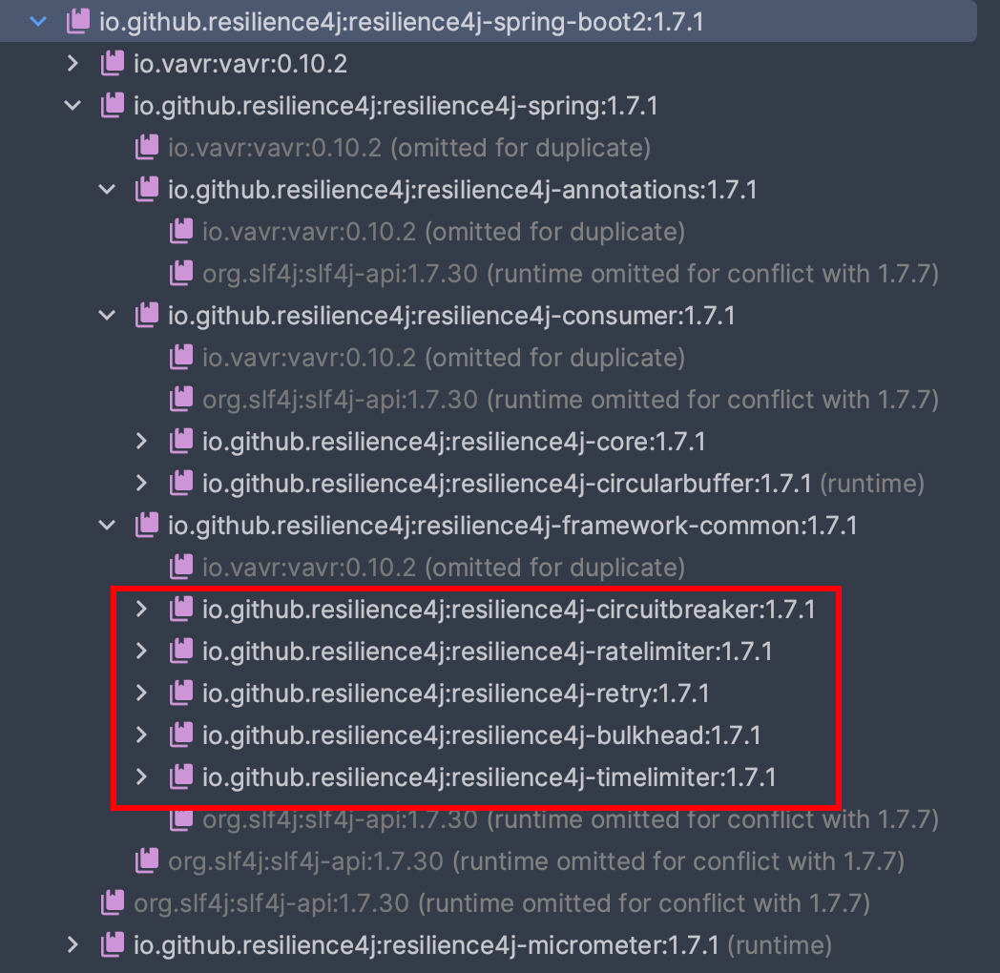

---

title: "Resilience4j-整合Springboot"
slug: "Resilience4j-整合Springboot"
description:
date: "2024-02-02T11:18:46+08:00"
lastmod: "2024-04-02T11:18:46+08:00"
image: cover.jpg
math:
license:
hidden: false
draft: false
categories: 
    - 微服务
tags: 
    - Resilience4j
    - 熔断限流

---

```
封面是《死亡搁浅》游戏中的 玛玛
```

官方有教程：[https://resilience4j.readme.io/v1.7.0/docs/getting-started-3](https://resilience4j.readme.io/v1.7.0/docs/getting-started-3)<br />这里做个简单使用记录。
<a name="IAN0C"></a>
## 版本要求
| Resilience4j版本 | JDK版本 |
| --- | --- |
| 1.7 | 8 |
| 2.0 | 17 |

这里用的jdk8，使用Resilience4j的1.7版本。mvn依赖如下
```xml
<dependency>
  <groupId>io.github.resilience4j</groupId>
  <artifactId>resilience4j-spring-boot2</artifactId>
  <version>1.7.1</version>
</dependency>
```

这个包把Resilience4j的基本组件都引入进来了。<br />


<a name="gxoCh"></a>
## yml配置
配置可以有三个层级的配置，分别可以继承。

- 修改默认配置
- 自定义可共享的配置
- 实例自定义配置

```yaml
resilience4j.circuitbreaker: # 指定对应的组件
    configs:
        default: # 修改默认配置
            slidingWindowSize: 100
            permittedNumberOfCallsInHalfOpenState: 10
            waitDurationInOpenState: 10000
            failureRateThreshold: 60
            eventConsumerBufferSize: 10
            registerHealthIndicator: true
        someShared: # 可共享的配置
            slidingWindowSize: 50
            permittedNumberOfCallsInHalfOpenState: 10
    instances: # 下面是实例自定义配置
        backendA: # 实例名称
            baseConfig: default # 指定继承的配置
            waitDurationInOpenState: 5000
        backendB:
            baseConfig: someShared
```


<a name="OcOer"></a>
## 事件监听器
Resilience4j提供了两种细粒度的时间监听

- Registry组件的增、删、替换事件
- 组件实例的状态变化事件

Resilience4j原生使用时在对应组件实例的基础上去进行设置监听，但是结合SpringBoot之后是没有办法直接拿到对应的组件实例。**可以通过监听实例的增、删、替换的动作，进而拿到对应的实例，之后再进行监听实例状态的变更。**

自己创建的RegistryEventConsumer的Bean，会自动添加到SpringBoot自身管理的CircuitBreakerRegistry中。<br />以监听CircuitBreaker组件为例，参考代码如下（IMessageService为自己的bean）
```java
@Bean
public RegistryEventConsumer<CircuitBreaker> circuitBreakerEventConsumer(IMessageService messageService){
return new RegistryEventConsumer<CircuitBreaker>() {
    @Override
    public void onEntryAddedEvent(EntryAddedEvent<CircuitBreaker> entryAddedEvent) {
        entryAddedEvent.getAddedEntry().getEventPublisher().onStateTransition(event -> {
            String circuitBreakerName = event.getCircuitBreakerName();
            CircuitBreaker.State fromState = event.getStateTransition().getFromState();
            CircuitBreaker.State toState = event.getStateTransition().getToState();

            log.info("CircuitBreaker '{}' changed state from {} to {}", circuitBreakerName, fromState, toState);
            StringBuilder builder = new StringBuilder();
            builder.append("<font color=\"warning\">断路器状态发生变化 ").append(DateUtil.now()).append(" </font>\n");
            builder.append("> 断路器名称：").append(circuitBreakerName).append("\n");
            builder.append("> 变化前状态：").append(fromState).append("\n");
            builder.append("> 变化后状态：").append(toState).append("\n");
            builder.append("请尽快处理！！！");
            messageService.reportDefaultMsg(builder.toString());
        });
    }

    @Override
    public void onEntryRemovedEvent(EntryRemovedEvent<CircuitBreaker> entryRemoveEvent) {

    }

    @Override
    public void onEntryReplacedEvent(EntryReplacedEvent<CircuitBreaker> entryReplacedEvent) {

    }
};
}
```

<a name="upO48"></a>
## 使用形式

<a name="piq3C"></a>
### 注解使用
只需要在对应的方法加上对应组件的直接即可。还可以在添加降级处理的方，会自动根据异常类型进行批量。
```java
@CircuitBreaker(name = BACKEND, fallbackMethod = "fallback")
@RateLimiter(name = BACKEND)
@Bulkhead(name = BACKEND, fallbackMethod = "fallback")
@Retry(name = BACKEND)
@TimeLimiter(name = BACKEND)
public Mono<String> method(String param1) {
    return Mono.error(new NumberFormatException());
}

private Mono<String> fallback(String param1, CallNotPermittedException e) {
    return Mono.just("Handled the exception when the CircuitBreaker is open");
}

private Mono<String> fallback(String param1, BulkheadFullException e) {
    return Mono.just("Handled the exception when the Bulkhead is full");
}

private Mono<String> fallback(String param1, NumberFormatException e) {
    return Mono.just("Handled the NumberFormatException");
}

// 其实也可以写一个通用的，内部if else好了，减少方法的数量
private Mono<String> fallback(String param1, Exception e) {
    return Mono.just("Handled any other exception");
}
```

<a name="b2Yiz"></a>
### 代码使用
**注解都是基于AOP去处理的，通病就是调用内部方法的时候是不会生效的**。可以手动获取到对应的实力。
```java
@Resource
private CircuitBreakerRegistry circuitBreakerRegistry;

// 从registry获取实例，和注解使用的是同一个实例
circuitBreakerRegistry.circuitBreaker("tencentAddressService");
```


<a name="VX2Rb"></a>
## starter的配置过程
结合SpringBoot的starter，流程基本就是读取配置，创建各种Bean组件。提供了各种注解，则过程就是基于Aop去实现的。这里简单看下CircuitBreaker的实现过程。

基本涉及两个类

- CircuitBreakerConfiguration配置类，负责启动时创建断路器相关的Bean
- CircuitBreakerAspect切面处理，CircuitBreaker注解的处理

<a name="Abfut"></a>
### Bean的生成
两个关键的Bean

- CircuitBreakerRegistry
- CircuitBreakerAspect
```java
@Bean
@Primary
public RegistryEventConsumer<CircuitBreaker> circuitBreakerRegistryEventConsumer(
    Optional<List<RegistryEventConsumer<CircuitBreaker>>> optionalRegistryEventConsumers) {
    // 自定义的RegistryEventConsumer会注入进来
    return new CompositeRegistryEventConsumer<>(
        optionalRegistryEventConsumers.orElseGet(ArrayList::new));
}

@Bean
public CircuitBreakerRegistry circuitBreakerRegistry(
    EventConsumerRegistry<CircuitBreakerEvent> eventConsumerRegistry,
    RegistryEventConsumer<CircuitBreaker> circuitBreakerRegistryEventConsumer,
    @Qualifier("compositeCircuitBreakerCustomizer") CompositeCustomizer<CircuitBreakerConfigCustomizer> compositeCircuitBreakerCustomizer) {

    CircuitBreakerRegistry circuitBreakerRegistry = createCircuitBreakerRegistry(
        circuitBreakerProperties, circuitBreakerRegistryEventConsumer,
        compositeCircuitBreakerCustomizer);
    registerEventConsumer(circuitBreakerRegistry, eventConsumerRegistry);
    // then pass the map here
    initCircuitBreakerRegistry(circuitBreakerRegistry, compositeCircuitBreakerCustomizer);
    return circuitBreakerRegistry;
}

@Bean
@Conditional(value = {AspectJOnClasspathCondition.class})
public CircuitBreakerAspect circuitBreakerAspect(
    CircuitBreakerRegistry circuitBreakerRegistry,
    @Autowired(required = false) List<CircuitBreakerAspectExt> circuitBreakerAspectExtList,
    FallbackDecorators fallbackDecorators,
    SpelResolver spelResolver
) {
    return new CircuitBreakerAspect(circuitBreakerProperties, circuitBreakerRegistry,
                                    circuitBreakerAspectExtList, fallbackDecorators, spelResolver);
}
```


<a name="LsPEE"></a>
### 切面处理逻辑
切面的逻辑比较简单

1. 看看有没有注解
2. circuitBreakerRegistry中获取CircuitBreaker实例
3. 是否使用fallback，不同的处理
```java
@Pointcut(value = "@within(circuitBreaker) || @annotation(circuitBreaker)", argNames = "circuitBreaker")
public void matchAnnotatedClassOrMethod(CircuitBreaker circuitBreaker) {
}

@Around(value = "matchAnnotatedClassOrMethod(circuitBreakerAnnotation)", argNames = "proceedingJoinPoint, circuitBreakerAnnotation")
public Object circuitBreakerAroundAdvice(ProceedingJoinPoint proceedingJoinPoint,
                                         @Nullable CircuitBreaker circuitBreakerAnnotation) throws Throwable {
    // 方法上有没有注解
    Method method = ((MethodSignature) proceedingJoinPoint.getSignature()).getMethod();
    String methodName = method.getDeclaringClass().getName() + "#" + method.getName();
    if (circuitBreakerAnnotation == null) {
        circuitBreakerAnnotation = getCircuitBreakerAnnotation(proceedingJoinPoint);
    }
    if (circuitBreakerAnnotation == null) { //because annotations wasn't found
        return proceedingJoinPoint.proceed();
    }
    // spel相关的
    String backend = spelResolver.resolve(method, proceedingJoinPoint.getArgs(), circuitBreakerAnnotation.name());
    io.github.resilience4j.circuitbreaker.CircuitBreaker circuitBreaker = getOrCreateCircuitBreaker(
        methodName, backend);
    Class<?> returnType = method.getReturnType();
    String fallbackMethodValue = spelResolver.resolve(method, proceedingJoinPoint.getArgs(), circuitBreakerAnnotation.fallbackMethod());

    // 没有fallback
    if (StringUtils.isEmpty(fallbackMethodValue)) {
        return proceed(proceedingJoinPoint, methodName, circuitBreaker, returnType);
    }

    // 有fallback
    FallbackMethod fallbackMethod = FallbackMethod
    .create(fallbackMethodValue, method,
            proceedingJoinPoint.getArgs(), proceedingJoinPoint.getTarget());
    return fallbackDecorators.decorate(fallbackMethod,
                                       () -> proceed(proceedingJoinPoint, methodName, circuitBreaker, returnType)).apply();
}
```


## 附录

### 参考

- [官方教程](https://resilience4j.readme.io/v1.7.0/docs/getting-started-3#demo)
- [How to configure to events in Resilience4j Spring starter](https://stackoverflow.com/questions/63681211/how-to-configure-to-events-in-resilience4j-spring-starter)