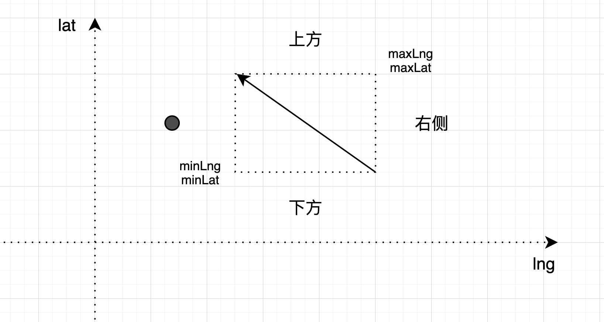

---

title: "射线法 判断点是否在多边形内"
slug: "射线法 判断点是否在多边形内"
description:
date: "2024-03-04T20:33:08+08:00"
lastmod: "2024-03-04T20:33:08+08:00"
image: cover.jpeg
math:
license:
hidden: false
draft: false
categories: 
    - 空间计算
tags: 
    - 射线法

---

> 封面壁纸为国漫《仙逆》的女主 李慕婉

<a name="lO1DN"></a>
## 射线法简介
射线法的基本思想是重目标点向一个方向引出一条无限的射线法，统计射线与多边形的边相交的数量

- 如果是偶数，则点在多边形外
- 如果是奇数，则点在多边形内

一般射线的方向是x轴的正数方向。算法的时间复杂度为O(n)，n为多边形的边（点）数。<br />


<a name="T629K"></a>
## 情况列举和分享
下面几种情况都算是点在多边形内

- 点在多边形内
- 点和多边形的顶点重叠
- 点在多边形的边上

**射线法将判断在多边形内，转移为判断点和边的关系**。所以算法的主要逻辑，就是在判断点射线和边的空间关系。有两种情况需要特殊处理。

- **射线经过边的顶点**
- **判断点在斜线的左侧的三角函数**

从点引出的射线和多边形的边有下面几种情况需要考虑

- 点在在边的上方、下方、右侧，不会相交
- 边水平的情况，不判断交点数，只判断是否在线上
- 射线经过边的顶点，则需要使用权重值来解决经过顶点的问题（涵盖了边垂直的情况）
   - B点在A点的下方，那么权重值-0.5
   - B点在A点的上方，那么权重值+0.5
- 边垂直的情况
   - 点在垂直的边P上，则点在多边形内
   - 点在在垂直的边的左边，则点与该边必然有交点
- 边斜线的情况
   - 点在线的左边，肯定会有交点
   - 通过三角函数来判断点是否在边的左边

<a name="cNjvA"></a>
## 各种情况的判断代码

点的表达
```java
@Data
@AllArgsConstructor
@NoArgsConstructor
public class Point {

    /**
     * 经度
     */
    private Double lng;
    /**
     * 纬度
     */
    private Double lat;

}
```


目标点和多边形的顶点重合
```java
// 顶点重合的情况
for (Point polygonPoint : polygonPoints) {
    if (Objects.equals(target, polygonPoint)) {
        return true;
    }
}
```


点在的上方、下方、右侧，射线肯定不会和边相交<br />


```java
if (target.getLat() < minLat || target.getLat() > maxLat || target.getLng() > maxLng) {
    pointA = pointB;
    continue;
}
```


边水平的情况,若点在水平的边上，则点在多边形内。平行重叠的情况，不做交点数判断。
```java
if (Objects.equals(pointA.getLat(), pointB.getLat())) {
    if (target.getLng() <= maxLng && target.getLng() >= minLng) {
        return true;
    }
    pointA = pointB;
    continue;
}
```

射线经过边的顶点(此时边可能垂直)，解决方案为：如果交点是待测多边形某个边上的一个顶点，则只有当该边的另一个顶点位于射线下方时，交点才算在内。这实际上等同于将与射线相交的顶点视为略高于射线。<br />


```java
if ((Objects.equals(target.getLat(), pointA.getLat()) && target.getLng() < pointA.getLng())
        || Objects.equals(target.getLat(), pointB.getLat()) && target.getLng() < pointB.getLng()) {
    if (pointB.getLat() < pointA.getLat()) {
        // B点在A点的下方，那么权重值-0.5
        intersectPointWeights -= 0.5;
    } else if (pointB.getLat() > pointA.getLat()) {
        // B点在A点的上方，那么权重值+0.5
        intersectPointWeights += 0.5;
    }
    pointA = pointB;
    continue;
}
```


边垂直的情况
```java

if (Objects.equals(pointA.getLng(), pointB.getLng())) {
    if (Objects.equals(target.getLng(), pointA.getLng())) {
        // 若点在垂直的边P上，则点在多边形内
        return true;
    } else if (target.getLng() < pointA.getLng()) {
        // 若点在在垂直的边的左边，则点与该边必然有交点
        intersectPointCount++;
    }
    pointA = pointB;
    continue;
}
```


边斜线的情况，使用三角函数来判断<br />


```java
if (target.getLng() <= minLng) {
    // 点point的x坐标在边的左侧，那么肯定相交
    intersectPointCount++;
} else if (target.getLng() < maxLng) {
    // 点point的x坐标在点B、A的x坐标中间
    double diff = (target.getLat() - pointA.getLat()) * (pointA.getLng() - pointB.getLng()) / (pointA.getLat() - pointB.getLat()) + pointA.getLng() - target.getLng();
    if (diff >= 0) {
        if (diff < PRECISION) {
            // 由于double精度在计算时会有损失，故匹配一定的容差
            // 点在斜线P1P2上
            return true;
        } else {
            // 点向右射线与斜线P1P2有交点
            intersectPointCount++;
        }
    }
}
```

<a name="hmTjy"></a>
## 测试示例
图形如下<br />


点集合，也就是多边形
```java
[{"lng":110.269889,"lat":21.308982},{"lng":110.277883,"lat":21.231378},{"lng":110.275219,"lat":21.178585},{"lng":110.309195,"lat":21.166692},{"lng":110.345361,"lat":21.166692},{"lng":110.345361,"lat":21.225846},{"lng":110.37871,"lat":21.218632},{"lng":110.416809,"lat":21.210863},{"lng":110.41919,"lat":21.224181},{"lng":110.419648,"lat":21.234822},{"lng":110.385148,"lat":21.282747},{"lng":110.351299,"lat":21.286387},{"lng":110.269889,"lat":21.308982}]
```

测试代码
```java
System.out.println("图形外，射线和线水平，不在线上：" + RayCastUtil.isPointInPolygon(new Point(110.301195,21.166692), polygonPointList));
System.out.println("图形内, 射线和线水平，在线上：" + RayCastUtil.isPointInPolygon(new Point(110.319195,21.166692), polygonPointList));

System.out.println("图形内，射线和线垂直：" + RayCastUtil.isPointInPolygon(new Point(110.319195,21.186692), polygonPointList));
System.out.println("图形外，射线和线垂直：" + RayCastUtil.isPointInPolygon(new Point(110.219195,21.186692), polygonPointList));

System.out.println("图形内，经过线顶点：" + RayCastUtil.isPointInPolygon(new Point(110.305361,21.225846), polygonPointList));
System.out.println("图形外，经过线顶点：" + RayCastUtil.isPointInPolygon(new Point(110.245361,21.225846), polygonPointList));

System.out.println("图形内，和一条斜线相交：" + RayCastUtil.isPointInPolygon(new Point(110.305361,21.265846), polygonPointList));
System.out.println("图形外，和一条斜线相交：" + RayCastUtil.isPointInPolygon(new Point(110.245361,21.265846), polygonPointList));

System.out.println("图形内，和多条线相交：" + RayCastUtil.isPointInPolygon(new Point(110.305361,21.221846), polygonPointList));
System.out.println("图形外，和多条线相交：" + RayCastUtil.isPointInPolygon(new Point(110.245361,21.221846), polygonPointList));
```

<a name="mCg4X"></a>
## 完整代码
```java
public class RayCastUtil {

    private static final double PRECISION = 2e-10;

    public static boolean isPointInPolygon(Point target, List<Point> polygonPoints) {

        // 这里不需要首尾相连，有些不需要，这就
        if (Objects.equals(polygonPoints.get(0), polygonPoints.get(polygonPoints.size() - 1))) {
            polygonPoints = polygonPoints.subList(0, polygonPoints.size() - 1);
        }

        // 顶点重合的情况
        for (Point polygonPoint : polygonPoints) {
            if (Objects.equals(target, polygonPoint)) {
                return true;
            }
        }

        // X轴射线与多边形的交点数
        int intersectPointCount = 0;
        // X轴射线与多边形顶点相交的权值
        double intersectPointWeights = 0;

        // pointA -> pointB 代表一条边
        Point pointA = polygonPoints.get(0);
        Point pointB = null;

        final int pointSize = polygonPoints.size();
        for (int i = 1; i <= pointSize; i++) {
            // for中定义<=以及这里的%取余，是为了关注最后一个节点连接首节点这条边的情况
            pointB = polygonPoints.get(i % pointSize);

            double minLat = Math.min(pointA.getLat(), pointB.getLat());
            double maxLat = Math.max(pointA.getLat(), pointB.getLat());
            double minLng = Math.min(pointA.getLng(), pointB.getLng());
            double maxLng = Math.max(pointA.getLng(), pointB.getLng());

            // 目标点在的上方、下方、右侧，那么就不会相交
            if (target.getLat() < minLat || target.getLat() > maxLat || target.getLng() > maxLng) {
                pointA = pointB;
                continue;
            }

            // 边水平的情况,若点在水平的边上，则点在多边形内,
            if (Objects.equals(pointA.getLat(), pointB.getLat())) {
                if (target.getLng() <= maxLng && target.getLng() >= minLng) {
                    return true;
                }
                pointA = pointB;
                continue;
            }

            // 边界处理：射线经过边的顶点(此时边可能垂直)
            if ((Objects.equals(target.getLat(), pointA.getLat()) && target.getLng() < pointA.getLng())
                    || Objects.equals(target.getLat(), pointB.getLat()) && target.getLng() < pointB.getLng()) {
                if (pointB.getLat() < pointA.getLat()) {
                    // B点在A点的下方，那么权重值-0.5
                    intersectPointWeights -= 0.5;
                } else if (pointB.getLat() > pointA.getLat()) {
                    // B点在A点的上方，那么权重值+0.5
                    intersectPointWeights += 0.5;
                }
                pointA = pointB;
                continue;
            }

            // 边垂直的情况
            if (Objects.equals(pointA.getLng(), pointB.getLng())) {
                if (Objects.equals(target.getLng(), pointA.getLng())) {
                    // 若点在垂直的边P上，则点在多边形内
                    return true;
                } else if (target.getLng() < pointA.getLng()) {
                    // 若点在在垂直的边的左边，则点与该边必然有交点
                    intersectPointCount++;
                }
                pointA = pointB;
                continue;
            }

            // 边斜的情况
            if (target.getLng() <= minLng) {
                // 点point的x坐标在边的左侧，那么肯定相交
                intersectPointCount++;
            } else if (target.getLng() < maxLng) {
                // 点point的x坐标在点B、A的x坐标中间
                double diff = (target.getLat() - pointA.getLat()) * (pointA.getLng() - pointB.getLng()) / (pointA.getLat() - pointB.getLat()) + pointA.getLng() - target.getLng();
                if (diff >= 0) {
                    if (diff < PRECISION) {
                        // 由于double精度在计算时会有损失，故匹配一定的容差
                        // 点在斜线P1P2上
                        return true;
                    } else {
                        // 点向右射线与斜线P1P2有交点
                        intersectPointCount++;
                    }
                }
            }
            pointA = pointB;
        }
        return (intersectPointCount + Math.abs(intersectPointWeights)) % 2 != 0;
    }

}
```

<a name="rzRKj"></a>


## 附录

### 参考

[YouTube视频：Checking if a point is inside a polygon is RIDICULOUSLY simple (Ray casting algorithm) - Inside code](https://www.youtube.com/watch?v=RSXM9bgqxJM&ab_channel=Insidecode)<br />

[判断点是否在多边形内的Python实现及小应用（射线法）](https://cloud.tencent.com/developer/article/1515808)<br />

[维基百科：多边形内的点](https://zh.wikipedia.org/wiki/%E5%A4%9A%E8%BE%B9%E5%BD%A2%E5%86%85%E7%9A%84%E7%82%B9)
