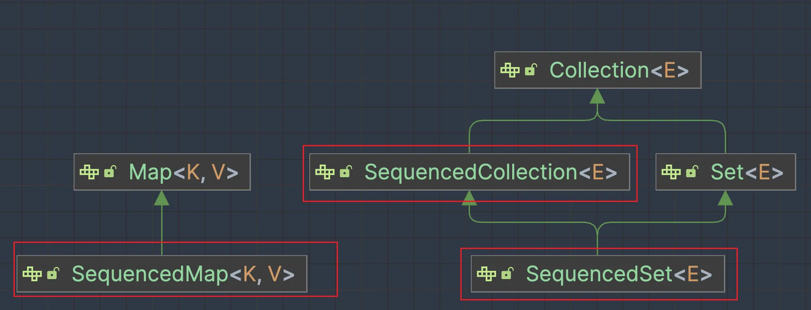
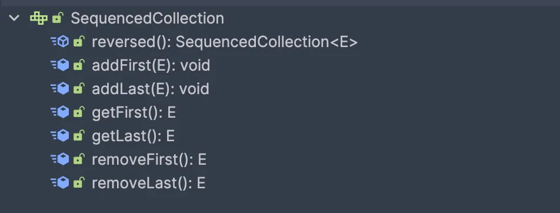
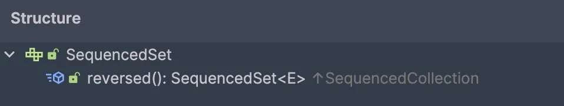
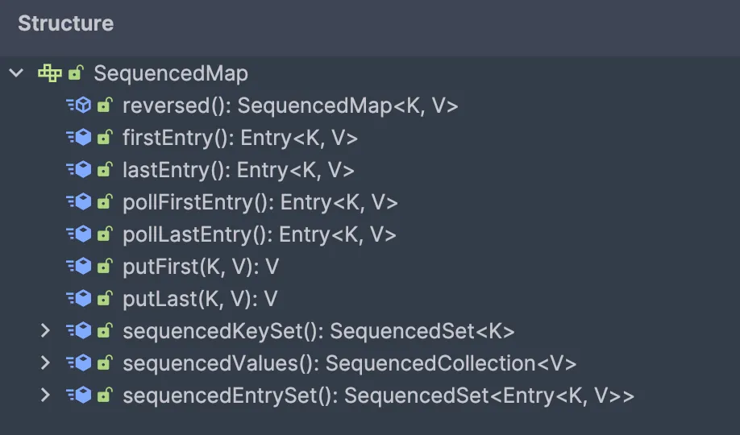

---

title: "Java21语法特性"
slug: "Java21语法特性"
description:
date: "2024-04-21T11:33:39+08:00"
lastmod: "2024-04-21T11:33:39+08:00"
image: cover.jpeg
math:
license:
hidden: false
draft: false
categories: ["Java新特性"]
tags: ["Java21新特性", "虚拟线程"]

---

> 封面是韩国的Arin，下面是抖音经常刷到的一个装扮

<div  align="center">    
 
</div>


这里直接使用SDKMAN进行jdk21的下载。（安利SDKMan这个工具，本地用来切换各版本sdk方便）
```
sdk install java 22.0.1-oracle
```


正式发布的（非预览）新特性。并对语法层面的，也就是核心Java库相关的做个简单记录。

| JEP | 分类 |
| --- | --- |
| [虚拟线程](https://openjdk.org/jeps/444) | 核心 Java 库 |
| [有序集合](https://openjdk.org/jeps/431) | 核心 Java 库 |
| [Record 模式](https://openjdk.org/jeps/440) | 核心 Java 库 |
| [switch 模式匹配](https://openjdk.org/jeps/441) | 核心 Java 库 |
| [分代 ZGC](https://openjdk.org/jeps/439) | HotSpot |
| [弃用 Windows 32 位 x86 端口](https://openjdk.org/jeps/449) | HotSpot |
| [准备禁止动态加载代理](https://openjdk.org/jeps/451) | HotSpot |
| [密钥封装机制 API](https://openjdk.org/jeps/452) | 安全库 |


<a name="zidTU"></a>
## 有序集合
[JEP 431](https://openjdk.org/jeps/431)

对于有序集合，，如List（ArrayList、LinkList等）、Deqeue、SortedSet等，没有一个共同的操作语义api区队双端就行操作。下面距离取第一个、最优一个元素的当前方式。

| Collection | First element | Last element |
| --- | --- | --- |
| **List** | list.get(0) | list.get(list.size() - 1) |
| **Deque** | deque.getFirst() | deque.getLast() |
| **SortedSet** | sortedSet.first() | sortedSet.last() |
| **LinkedHashSet** | linkedHashSet.iterator().next() | // missing |


实际开发中最常见的就是list.get(0)、list.get(list.size() - 1)。在上述背景下，新增了三个接口：SequencedCollection、SequencedSet、SequencedMap。下面来看下这三个接口的相关定义。

下面是三个接口在集合框架体系中的关系。


SequencedCollection接口定义如下，都是对于首尾操作的方法，还有一个反转顺序的操作。


SequencedSet继承自SequenceCollection，重写了reversed方法的返回值而已。


SequencedMap是自己单独定义的，需要留意两个方法的返回值

- sequencedKeySet返回SequencedSet
- sequenedValues返回SequencdCollection



对于首尾操作就不需要自己去遍历或者指定index了，还加多了一个reverse操作。

<a name="PjRTX"></a>
## Record模式
[JEP440](https://openjdk.org/jeps/440)

对于Record在日常使用者，个人还没有使用上（日常工作还在Java8），感触不是很深，先不研究。

<a name="jWai5"></a>
## switch支持数据类型匹配
直观感受就是支持了数据类型匹配，还支持null匹配👍。
```java
public class Main {
    public static void main(String[] args) {
        System.out.println(getTypeStr(1));
        System.out.println(getTypeStr("hello"));
        System.out.println(getTypeStr(12.12d));
        System.out.println(getTypeStr(123L));
        System.out.println(getTypeStr(true));
    }

    public static String getTypeStr(Object o) {
        return switch (o) {
            case null -> "null";
            case Integer i -> String.format("int %d", i);
            case Long l -> String.format("long %d", l);
            case Double d -> String.format("double %f", d);
            case String s -> String.format("String %s", s);
            case Boolean b -> String.format("Boolean %b", b);
            default -> o.toString();
        };
    }
}
```


<a name="bk2EY"></a>
## VirtualThread虚拟线程
[JEP444](https://openjdk.org/jeps/444)

什么事虚拟线程？看下VirtualThread类上的注释。（一句话就明白了）
> A thread that is scheduled by the Java virtual machine rather than the operating system.


对于开发者来说虚拟线程在使用体验上和 Thread 几乎没有区别，与之前的 API 互相兼容，但是相比之下虚拟线程资源占用非常少。下面来对比一下使用。

Thread类的使用方式
```java
// 原始线程的使用
Thread thread = new Thread(() -> {
    System.out.println("hello thread");
}, "SystemThread");
thread.start();

// 虚拟线程
Thread virtualThread = Thread.ofVirtual().name("VirtualThread").unstarted(() -> {
    System.out.println("hello virtual thread");
});
virtualThread.start();

Thread.startVirtualThread(() -> {
    System.out.println("hello virtual thread, startVirtualThread");
});
```

ExecutorService线程池使用方式
```java
// 创建并提交执行虚拟线程
long start = System.currentTimeMillis();
try (var executor = Executors.newVirtualThreadPerTaskExecutor()) {
    IntStream.range(0, 10_000).forEach(i -> {
        executor.submit(() -> {
            Thread.sleep(Duration.ofSeconds(1));
            return i;
        });
    });
}
System.out.println("time:" + (System.currentTimeMillis() - start) + "ms");
```

VirtualThread是不需要池化的，用的时候新建即可。后续会对这一块进一步研究学习。
<a name="N2OXm"></a>

## 附录

### 参考

- [Java 21 新功能介绍 (LTS)](https://www.wdbyte.com/java/java-21/)
- [咖啡屋视频：通向Java21-02-Java虚拟线程](https://www.bilibili.com/video/BV1Ju4y1Q788/)
- [咖啡屋视频：通向Java21-04-新的API](https://www.bilibili.com/video/BV1mF411U7XW/)
- [咖啡屋视频：通向Java21-07-完整的模式匹配【最终回】](https://www.bilibili.com/video/BV1bK4y1F7vo/)

