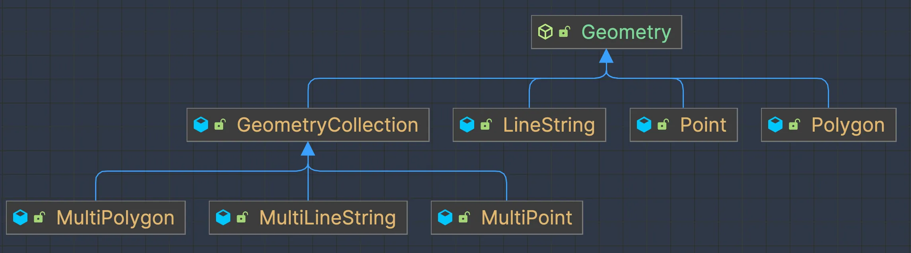
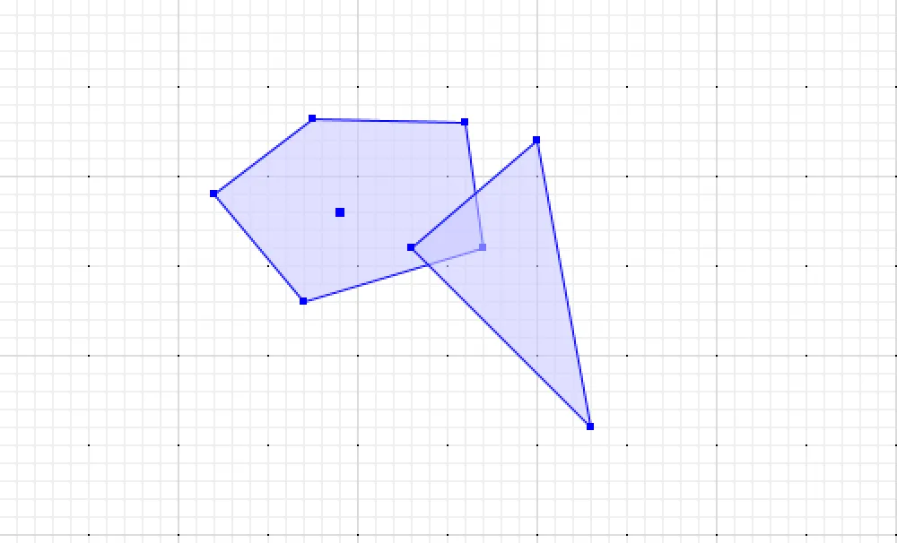
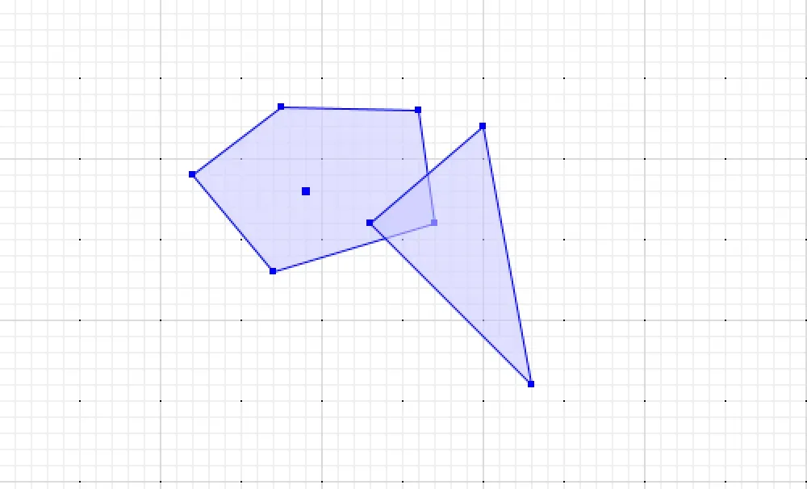
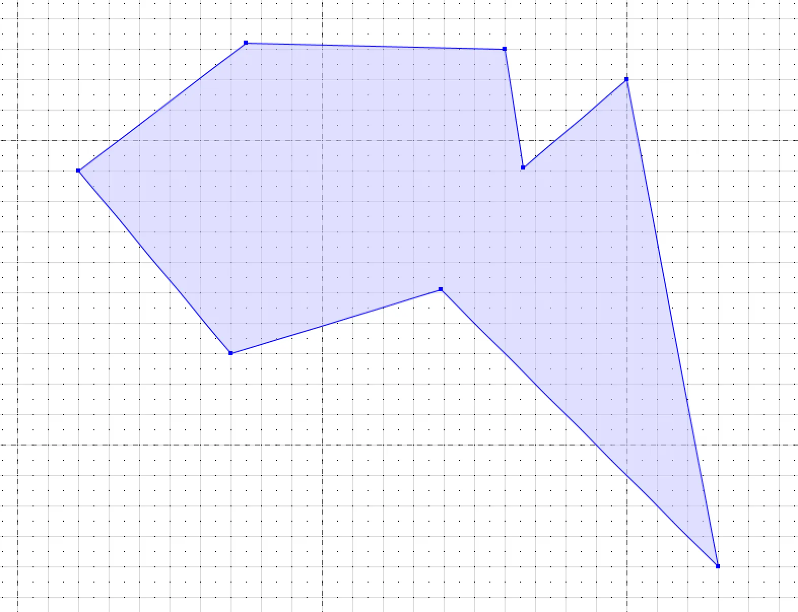
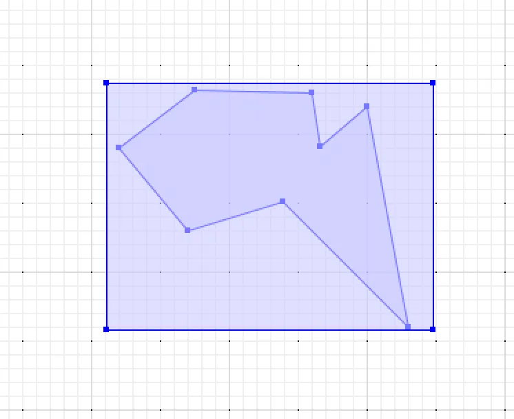
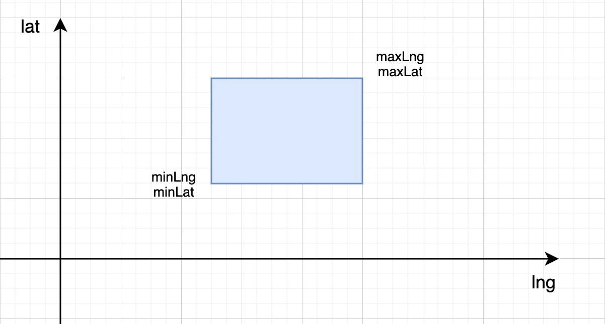

---

title: "JavaTopologySuite的简单使用"
slug: "JavaTopologySuite的简单使用"
description:
date: "2024-07-17T20:25:28+08:00"
lastmod: "2024-07-17T20:25:28+08:00"
image: cover.png
math:
license:
hidden: false
draft: false
categories: ["空间计算"]
tags: ["GIS", "JTS", "几何图形"]

---

> 封面是《诛仙》动漫中的小白，白狐


JTS，全称Java Topology Suite，是一个用于创建和操作向量几何的Java库。提供了对几何模型的抽象，以及各种空间操作和空间关系判断，非常强大。
## 引入jar包
JTS有多个模块，这里只使用了核心的模块。

- jts-core：提供几何模型的抽象、空间操作、空间关系判断算法等
- jts-io-common：提供各种格式描述几何模型的输入输出包，如对WKT、WKB等格式
```xml
<dependency>
  <groupId>org.locationtech.jts</groupId>
  <artifactId>jts-core</artifactId>
  <version>1.19.0</version>
</dependency>

<dependency>
    <groupId>org.locationtech.jts.io</groupId>
    <artifactId>jts-io-common</artifactId>
    <version>1.19.0</version>
</dependency>
```

## 几何模型
JTS提供了常见的集合模型抽象，并且各具特点。

| 模型 | 定义 | 常见应用 |
| --- | --- | --- |
| 点（Point） | 表示空间中的单个位置，由一对x,y坐标表示 | 表示兴趣点、事件位置等 |
| 多点（MultiPoint） | 由多个独立的点组成的几何对象 | 表示多个相关但分散的位置，如连锁店分布，多个不同人位置 |
| 线（LineString） | 由一系列点组成的一维几何对象，有起点和终点，中间可以有任意数量的点 | 表示道路、河流等线性特征 |
| 多线（MultiLineString） | 由多个不相连的LineString组成的几何对象 | 表示复杂的道路网络、等高线等 |
| 多边形（Polygon） | 由一系列首尾相连的线段围成的平面区域（可以有内部空洞） | 表示行政区划、建筑物轮廓等 |
| 多多边形（MultiPolygon） | 由多个独立的Polygon组成的几何对象，可以表示不相连的多个区域 | 表示群岛、复杂的行政区划 |
| 几何集合（GeometryCollection） | 可以包含任意类型几何对象的集合，最灵活的几何类型，可以混合包含点、线、面等 | 表示复杂的空间场景，如包含多种类型要素的地图 |


JTS中的各几何模型对象如下，可以看到顶层的几何对象Geometry，所有实际的几何对象都继承该对象。


## 空间描述格式-WKB
 WKT（Well-Know Text）格式是一种文本格式，用于描述二维和三维几何对象的空间特征。
WKT的基本语法格式如下：
```
几何模型类型 (模型数据)
```

示例如下所示
```
点：POINT (282 455)
线：LINESTRING (260 250, 485 248, 520 380)
多边形：POLYGON ((320 390, 370 330, 470 360, 460 430, 375 432, 320 390))
```

JTS支持对该格式的读写操作，主要是两个对象`WKTReader`和`WKTWriter`，代码示例如下
```java
// 读取wkt描述的几何对象
WKTReader wktReader = new WKTReader();
Geometry point = wktReader.read("POINT (282 455)");
Geometry line = wktReader.read("LINESTRING (260 250, 485 248, 520 380)");
Geometry polygon = wktReader.read("POLYGON ((320 390, 370 330, 470 360, 460 430, 375 432, 320 390))");

// 输出几何对象的wkt描述
WKTWriter wktWriter = new WKTWriter();
System.out.println(wktWriter.write(point));
System.out.println(wktWriter.write(line));
System.out.println(wktWriter.write(polygon));
```

## 空间关系
JTS中的空间关系是基于DE-9IM（Dimensionally Extended Nine-Intersection Model）模型定义的，这里列举常见的空间关系

| 空间关系 | 定义 |
| --- | --- |
| 相等 (Equals) | 两个几何对象在拓扑上相等 |
| 相离 (Disjoint) | 两个几何对象没有任何共同点 |
| 相交 (Intersects) | 两个几何对象有至少一个共同点 |
| 内含 (Within) | 几何对象A完全位于几何对象B内部 |
| 包含 (Contains) | 几何对象A完全包含几何对象B |


以该图形为例，两个多边形的关系判断的代码示例


```java
WKTReader wktReader = new WKTReader();
Geometry geometryA = wktReader.read("POLYGON ((320 390, 370 330, 470 360, 460 430, 375 432, 320 390))");
Geometry geometryB = wktReader.read("POLYGON ((500 420, 430 360, 530 260, 500 420))");

System.out.println("Equal: " + geometryA.equals(geometryB));
System.out.println("Disjoint: " + geometryA.disjoint(geometryB));
System.out.println("Intersects: " + geometryA.intersects(geometryB));
System.out.println("Within: " + geometryA.within(geometryB));
System.out.println("Contains: " + geometryA.contains(geometryB));
```

## 空间操作
JTS提供了丰富的空间操作功能，用于处理和分析几何对象。这里列举常见的几种

| 空间操作 | 定义 |
| --- | --- |
| 相交 (Intersection)  | 计算两个几何对象的共同部分 |
| 并集 (Union) | 合并两个或多个几何对象 |
| 差集 (Difference) | 从一个几何对象中减去另一个几何对象 |


以该图为例，操作示例代码如下


```java
WKTReader wktReader = new WKTReader();
Geometry geometryA = wktReader.read("POLYGON ((320 390, 370 330, 470 360, 460 430, 375 432, 320 390))");
Geometry geometryB = wktReader.read("POLYGON ((500 420, 430 360, 530 260, 500 420))");

System.out.println("Intersection: " + wktWriter.write(geometryA.intersection(geometryB)));
System.out.println("Union: " + wktWriter.write(geometryA.union(geometryB)));
System.out.println("Difference: " + wktWriter.write(geometryA.difference(geometryB)));
```

下面是Union合并后的效果



## 空间索引
### 最小外接矩形（MBR）
最小外接矩形MBR (Minimum Bounding Retangle)，是能够完全包含一个几何对象的最小矩形。
如下图所示，这个规则的矩形就是该多边形的MBR表示。


表示MBR非常简单，只需要知道他的左下角和右上角，那么就可以知道这个MBR图形了。如下图所示


知道了这个最小外接矩形有什么用？
**这里有个断言：如果点不在这个MBR内了，那么肯定不在这个多边形内**。所以把点和MBR进行比较，就能够快速排除不可能有关系的多边形对象。

那么如何快速的判断点是否在MBR中？比较坐标值的大小就可以了。示例代码如下
```java
mbr.getLngMin() <= point.getLng()
&& mbr.getLngMax() >= point.getLng()
&& mbr.getLatMin() <= point.getLat()
&& mbr.getLatMax() >= point.getLat()
```

综上，MBR用简单的矩形来近似表示复杂的几何形状，将复杂的空间关系简化为矩形之间的关系。通过MBR这一层的初步筛选，就能够快速排除不可能有关系的多边形对象。

在JTS中，Envelope对象来表示MBR。代码示例如下
```java
WKTReader wktReader = new WKTReader();
Geometry geometryA = wktReader.read("POLYGON ((320 390, 370 330, 470 360, 460 430, 375 432, 320 390))");

Envelope envelope = geometryA.getEnvelopeInternal();
System.out.println(envelope.getMaxX());
System.out.println(envelope.getMaxY());
System.out.println(envelope.getMinX());
System.out.println(envelope.getMinY());
```

### 空间索引
上述构建MBR可以理解为简单索引的一种，实际上有复杂的空间索引。常见空间索引有

- R树（R-tree）：平衡树，适用于多维空间数据（类似一维的B+树）
- 四叉树（Quad-tree）：将二维空间递归地分为四个象限
- 网格（Grid）：将空间划分为规则的网格单元

JTS提供了Quadtree（四叉树）、STRtree（基于R树的变体）的实现。构建R树空间索引的示例代码如下
```java
WKTReader wktReader = new WKTReader();
Geometry geometryA = wktReader.read("POLYGON ((320 390, 370 330, 470 360, 460 430, 375 432, 320 390))");
Geometry geometryB = wktReader.read("POLYGON ((500 420, 430 360, 530 260, 500 420))");

STRtree rtree = new STRtree();
// 向R树种添加MBR，和自己的数据
rtree.insert(geometryA.getEnvelopeInternal(), "Polygon-A");
rtree.insert(geometryB.getEnvelopeInternal(), "Polygon-B");
rtree.build();

// 点只在Polygon-A中
System.out.println(rtree.query(wktReader.read("POINT (337 391)").getEnvelopeInternal()));
// 点只在Polygon-B中
System.out.println(rtree.query(wktReader.read("POINT (496 390)").getEnvelopeInternal()));
// 点在Polygon-A和Polygon-B的交集中
System.out.println(rtree.query(wktReader.read("POINT (452 367)").getEnvelopeInternal()));
```
## 总结
JTS还是很强大的，提供了几乎所有的空间计算上的东西。在实际应用过程中，需要加快一些计算过程，就需要使用上空间索引，一般都是在内存中构建索引树。在JTS之上，还有个基于JTS的GeoTools的工具，这个是更为强大。这一块由于只是处于应用层面，涉及的一些算法上的计算等就不过于深究，毕竟专业性较强。


## 附录

### 参考

- [Java Topology Suite (JTS) ](https://github.com/locationtech/jts)
- [GIS原理在线教程](https://www.osgeo.cn/gis-tutorial/index.html)

