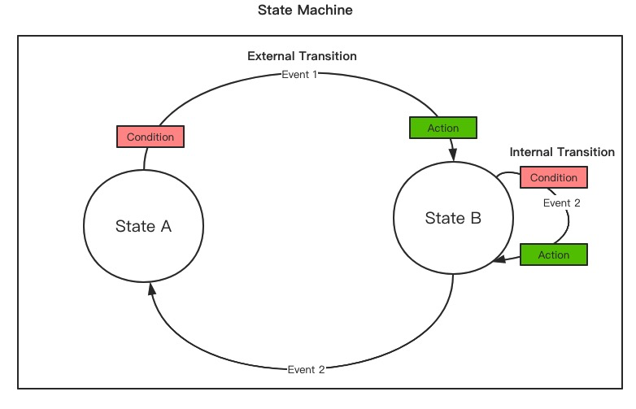

---

title: "状态机篇一：概念理解"
slug: "状态机篇一：概念理解"
description:
date: "2024-08-16T10:21:36+08:00"
lastmod: "2024-08-16T10:21:36+08:00"
image: cover.png
math:
license:
hidden: false
draft: false
categories: ["状态机"]
tags: ["状态机", "有限状态机", "状态机概念"]

---

> 封面来自《诛仙》48集，陆雪琪

状态通常是用来描述一个事务当前是处于一个什么阶段（状态），在日常生活中最常见的就是电气的开关状态了，如空调、风扇开关灯。而在通常的项目设计中都会应用到，最常见的就是订单状态了：待支付、已支付、已取消等状态。

有限状态机（Finite-state Machine，FSM），是表示有限个状态以及在这些状态之间的转移和动作等行为的数学计算模型。就是对现实事物运行状态管理进行抽象，形成了一套状态机的概念。

## 基础概念

FSM有非常多的概念，这里介绍几个核心的概念。状态机基础概念概括如下图所示（源自COLA状态机文章）

### 状态State

状态这个概念就很好理解了，就是当前事务处于一个什么状态。在状态机中，至少需要2个状态，毕竟只有一个状态根本就不需要流转，也不需要管理了。
有限的状态集合里边，事物必须包含一个起点，也就是必须具有初始状态（Initial State），而终态（End State）不是必须的。

### 状态转变Transition

状态的切换：原状态过度到目标状态，这个转变过程称之为Transition。状态的转变通常是由触发器引起的，这里的触发器一种抽象，可以是定时器、各种事件等。（其实超时也可以理解成事件）。
但是如果发生了某些事件但是原状态和目标状态是一致的，没有引起状态的Transition。这种场景还是挺常见的，例如订单收货地址的变更，这个动作并不会驱动订单状态的变化。那么是否可以继续使用这个抽象？

为了区分这两种情况，定义了两种的Transition

- 内部转变（InternalTransition）：同一状态的流转
- 外部转变（ExternalTransition）：两个不同状态之间的流转

### 事件Event

事件是驱动状态切换的最常见的方式，简单的说就是发生了某些事情，会触发状态变更。例如，用户已经支付了订单，此时订单需要由待支付转变成已支付的状态。

### 动作Action

动作Action是更加具体的行为，例如如何实现来实现Transition，状态发生转变后可能需要做点其他事情，如发短信之类的动作。
可以理解为原状态到目标状态的Transition是由多个Action组成的

- 转移动作（Transition Actions）：在状态转移过程中执行的动作。
- 进入动作（Entry Actions）：在进入某个状态时执行的动作。
- 退出动作（Exit Actions）：在退出某个状态时执行的动作。

### 守护条件Condition

Condition是对<状态，事件>这个二元组的拓展，该条件通过计算返回布尔值。当通过这个二元组来定位到多个Transition的时候，就需要这个Condition来动态决定选择特定的Transition来实现状态的转换。
当二元组值定位到一个Condition的时候，可以把Condition理解为是否允许到达某个状态。

## 状态流转过程

状态机对状态进行统一的管理，状态机就需要知道状态是怎么流转的，哪些状态可以流转到哪些状态，例如待支付可以流转到已支付，但是不能够流转到已退款等，所以需要一个提前配置状态机的过程。简单的配置就是四元组：

> <当前状态，事件，目标状态，转换过程Transition>

当前事务的初始状态状态（Current State），发生了某个事件（Event），触发了转换过程（Transition）来实现流转状态到目标状态（Target State）。

配置好后，就等待事件来触发某单个事物的状态流转。状态机实现状态的流转逻辑也比较简单，首先是事物（例如某笔订单）肯定发生了某个事件，之后根据该事物的当前状态，就构成了一个二元组：

> <当前状态，事件>

状态机根据配置就可以找到对应的目标状态（Target State）以及转换（Transition），状态机通过执行该Transition的Action来实现状态的流转。如果找不到该目标状态和Transition，代表无法进行状态流转。

## 复杂概念

在[UML State Machine](https://www.uml-diagrams.org/state-machine-diagrams.html)的描述中，还有许多复杂的概念，如：层级状态机（Hierarchical State Machines），状态的嵌套（substate），状态的并行（parallel，fork，join），区域（Region）等等。这些概念都非常复杂，现实中还未接触过，理解不深，就不在这里解释描述了。
可以参考下面的文档：

- [SpringStateMachine文档：state-machine-concepts](https://docs.spring.io/spring-statemachine/docs/4.0.0/reference/index.html#state-machine-concepts)（看其附录）
- [UML State Machine](https://www.uml-diagrams.org/state-machine-diagrams.html)

## 总结

有限状态机把状态管理相关的行为抽象成：状态State、转变Transition、事件Event、动作Action、守护条件Condition等概念。通过对状态机进行配置，来描述状态及事件触发的流转路线，以及实现流转的Transition。
应用状态机，主要是为了对状态进行集中管理，明确状态的流转，避免流转代码的散乱，进而提高了可维护性。

## 附录

### 参考

- [维基百科：有限状态机](https://zh.wikipedia.org/wiki/%E6%9C%89%E9%99%90%E7%8A%B6%E6%80%81%E6%9C%BA)
- [SpringStateMachine文档：state-machine-concepts](https://docs.spring.io/spring-statemachine/docs/4.0.0/reference/index.html#state-machine-concepts)
- [UML State Machine](https://www.uml-diagrams.org/state-machine-diagrams.html)
- [实现一个状态机引擎，教你看清DSL的本质](https://blog.csdn.net/significantfrank/article/details/104996419)
