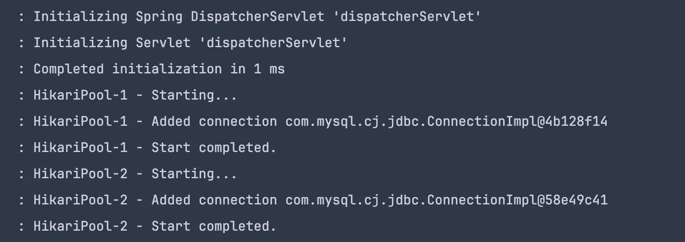

---

title: "SpringBoot多数据源配置（一）：Mybatis篇"
slug: "SpringBoot多数据源配置（一）：Mybatis篇"
description:
date: "2024-09-03T11:51:02+08:00"
lastmod: "2024-09-03T11:51:02+08:00"
image: cover.png
math:
license:
hidden: false
draft: false
categories: ["SpringBoot","Mybatis"]
tags: ["SpringBoot", "Mybatis", "多数据源配置"]

---

> 封面来自《诛仙》48集，陆雪琪

某天，朋友问事务怎么失效了，注解和手动事务都试过了，而且debug走代码确实走到了Spring的事务注解拦截器里边了。和他探讨了一下，原来是他项目配置了多个可写数据源的原因。这种情况自己确实没有遇到过，遂记录一下。

## 环境&数据准备

这里使用的环境如下

- JDK17
- SpringBoot3.3.3

pom依赖如下

```java
<dependency>
    <groupId>org.springframework.boot</groupId>
    <artifactId>spring-boot-starter-web</artifactId>
</dependency>

<dependency>
    <groupId>com.mysql</groupId>
    <artifactId>mysql-connector-j</artifactId>
    <scope>runtime</scope>
</dependency>
<dependency>
    <groupId>org.projectlombok</groupId>
    <artifactId>lombok</artifactId>
    <optional>true</optional>
</dependency>
<dependency>
    <groupId>org.springframework.boot</groupId>
    <artifactId>spring-boot-starter-test</artifactId>
    <scope>test</scope>
</dependency>

<dependency>
    <groupId>org.mybatis.spring.boot</groupId>
    <artifactId>mybatis-spring-boot-starter</artifactId>
    <version>3.0.3</version>
</dependency>
```

先创建两个库

- 创建库testA，创建表user
- 创建库testB，创建表addr
```sql
create table user
(
  id    bigint auto_increment comment '主键ID'
  primary key,
  name  varchar(30) null comment '姓名',
  age   int         null comment '年龄',
  email varchar(50) null comment '邮箱'
);

create table addr
(
  id      int auto_increment primary key,
  uid     int          null,
  address varchar(128) null
);

INSERT INTO testA.user (id, name, age, email) VALUES (1, 'JOJO', 22, '123@abc.com');

INSERT INTO testB.addr (id, uid, address) VALUES (1, 1, '广东省XXX市');

```

## Mybatis自动化配置

先看下Mybatis的自动化配置是怎样的


Mybatis的自动化配置只支持单一的数据源，并且构建了两个重要的组件：`SqlSessionFactory`、`SqlSessionTemplate`。若配置多数据源的话，需要自己创建这两个组件。

在使用过程中，通常会在SpringBoot的启动类上加`@MapperScan`的注解，会扫描Mapper接口，生成对应的代理实现类。这里边有两个属性比较重要：`sqlSessionFactoryRef`、`sqlSessionTemplateRef`，可以指定生成的代理实现类所使用的`SqlSessionFactory`、`SqlSessionTemplate`实例。


在和SpringBoot整合的时候，只需要指定sqlSessionTemplate即可，因为该类就是Mybatis-Spring包中适配Spring环境的。

## 多数据源配置

自定义数据源配置Mybatis，可以跟着`MybatisAutoConfiguration`来自己写配置，并且通过`@MapperScan`来指定对应的Mapper代理使用的`SqlSessionTemplate`实例。`@MapperScan` 是根据包来扫描的，所以我们的Mapper需要根据DataSource来分package。

除了Mybatis的配置外，我们还需要进行SpringBoot的`TransactionManager`配置，是和`DataSource`关联的，如果配置了多个`DataSource`，那么就要相对应的配置对应的`TransactionManager`。

下来看下yml的配置，没什么特别的，只是配置两个数据源

```sql
spring:
  application:
    name: spring-demo
  datasource:
    user:
      type: com.zaxxer.hikari.HikariDataSource
      driver-class-name: com.mysql.cj.jdbc.Driver
      jdbcUrl: jdbc:mysql://localhost:3306/testA
      username: root
      password: 123456
    addr:
      type: com.zaxxer.hikari.HikariDataSource
      driver-class-name: com.mysql.cj.jdbc.Driver
      jdbcUrl: jdbc:mysql://localhost:3306/testB
      username: root
      password: 123456
```

接下来就要对`DataSource`、`SqlSessionFactory`、`SqlSessionTemplate`、`@MapperScan`进行配置了。先来看看user库的配置，这里把他作为Primary。对于Mybatis的众多配置，如xml的扫描路径、插件配置等，都可以在构建`SqlSessionFactory`的方法内进行。

```java
@Configuration
@MapperScan(value = "com.example.springdemo.mapper.user", 
        sqlSessionTemplateRef = "userSqlSessionTemplate")
public class UserDataSourceConfig {
    
    @Primary
    @Bean("userDataSource")
    @ConfigurationProperties(prefix = "spring.datasource.user")
    public DataSource userDataSource() {
        return DataSourceBuilder.create().build();
    }


    @Primary
    @Bean
    public PlatformTransactionManager userTransactionManager(@Qualifier("userDataSource") DataSource  dataSource) {
        return new JdbcTransactionManager(dataSource);
    }


    @Primary
    @Bean
    public SqlSessionFactory userSqlSessionFactory(@Qualifier("userDataSource") DataSource  dataSource) throws Exception {
        SqlSessionFactoryBean sqlSessionFactoryBean = new SqlSessionFactoryBean();
        sqlSessionFactoryBean.setDataSource(dataSource);
        return sqlSessionFactoryBean.getObject();
    }


    @Primary
    @Bean
    public SqlSessionTemplate userSqlSessionTemplate(@Qualifier("userSqlSessionFactory") SqlSessionFactory sqlSessionFactory) {
        return new SqlSessionTemplate(sqlSessionFactory);
    }
}
```

同样的，进行addr数据源的相关配置，不同在于这里也没有Primary。

```java
@Configuration
@MapperScan(value = "com.example.springdemo.mapper.addr",
        sqlSessionTemplateRef = "addrSqlSessionTemplate")
public class AddrDataSourceConfig {


    @Bean("addrDataSource")
    @ConfigurationProperties(prefix = "spring.datasource.addr")
    public DataSource addrDataSource() {
        return DataSourceBuilder.create().build();
    }


    @Bean
    public PlatformTransactionManager addrTransactionManager( @Qualifier("addrDataSource") DataSource  dataSource) {
        return new JdbcTransactionManager(dataSource);
    }

    @Bean
    public SqlSessionFactory addrSqlSessionFactory(@Qualifier("addrDataSource") DataSource  dataSource) throws Exception {
        SqlSessionFactoryBean sqlSessionFactoryBean = new SqlSessionFactoryBean();
        sqlSessionFactoryBean.setDataSource(dataSource);
        // 这里进行Mybatis配置
        return sqlSessionFactoryBean.getObject();
    }

    @Bean
    public SqlSessionTemplate addrSqlSessionTemplate(@Qualifier("addrSqlSessionFactory") SqlSessionFactory sqlSessionFactory) {
        return new SqlSessionTemplate(sqlSessionFactory);
    }

}
```

这里需要注意了，`@MapperScan`注解上的value，也就是basePackage的值，是指定了不同目录的，不同数据源的Mapper要通过不同的包进行归类，不同放在一起。


## 测试配置

接下来进行测试，这里引入了web项目，开了两个查询接口。下面是IDEA的http配置

```java
###
GET http://localhost:8080/user/1

###
GET http://localhost:8080/addr/1
```

分别调用这俩接口的时候，获取的数据都是正常的，可以看到日志的打印，分别启动了两个数据源。


至此，两个数据源的配置完成。

## 事务失效的场景

如果一个方法同时修改两个数据源，单数据源事务不生效很正常，涉及到分布式事务了。这里主要探讨分析的是更新单个数据源事务失效的情况。

基于上述配置，更新看下下面的示例代码

```java
// 多数据源更新
@Transactional
public void updateInfo() {
    // 这个会回滚
    userMapper.update();
    // 这个不会回滚
    addrMapper.update();
    throw new RuntimeException("test rollback");
}

// 单数据源更新
@Transactional
public void updateInfo() {
    // 这个不会回滚
    addrMapper.update();
    throw new RuntimeException("test rollback");
}

```

示例代码中事务都是失效的的，两个数据已经发生了变更，回滚不生效。下面以第二个更新单个数据源的示例来分析下原因。
先回顾下配置

- 主数据源是user，主事务管理器是userTransactionManager
- 还有数据源addr，其对应的事务管理器为addrTransactionManager

在事务注解`@Transactional`未指定事务管理器的情况下，使用默认的事务管理器`userTransactionManager` ，也就是使用的是user的数据源。那么`updateInfo`方法开启的就是user数据源的事务。然而

- addrMapper使用的是addr数据源，自己的独立事务

在执行到手动抛出异常的时候，addrMapper.update所属数据源addr的事务已经提交了，但是user的事务还在进行中，当抛出异常的时候，Spring会捕获该异常并且回滚user的事务。这就是事务失效的原因，为解决这个问题，需要在事务注解指定事务管理器

> @Transactional(value = "addrTransactionManager")

总结事务失效的场景就是：**事务注解使用的事务管理器要和方法内部操作的数据源对应，否则事务不生效。**


## 总结
SpringBoot+Mybatis的多数据源配置演示完成了，主要是需要配置如下组件

- DataSource
- TransactionManager
- SqlSessionFactory
- SqlSessionTemplate

除了这四个组件外，并且在Mapper的使用上，需要根据数据源进行分package，并且事务注解`@Transactional`需要指定事务管理器。

这种配置方式，有个很明显的缺点：有多少个数据源，就得实现多少套组件的配置，并且Mapper要分别存放，事务注解要指定事务管理器。这个一看就很繁琐，在实际应用中这种方式比较少见，毕竟同时写多个数据源在实际中就应该避免，否则就涉及到分布式事务了。

Spring提供了一个抽象类`AbstractRoutingDataSource`来更好的支持多数据源的配置，这个下一篇会进行描述。

## 附录

### 参考
